# cntlm-proxy-dbeaver

cntlm-proxy-dbeaver

Configure um túnel com cntlm para uso como proxy no dbeaver.

Mais informações: http://fontes.caixa/FGTS/DES/conhecimento/wikis/data/dbeaver-cntlm

## Como configurar

- logue como administrador da máquina
- via Windows Explorer, acesse a pasta `%windir%\system32`
- clique com o botão direito, e abra o `taskschd.msc` como Administrador

Na tela que se abrirá, do Agendador de Tarefas, crie uma nova tarefa (veja referência):

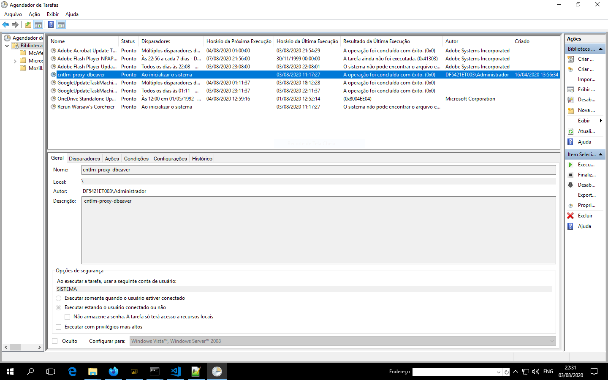

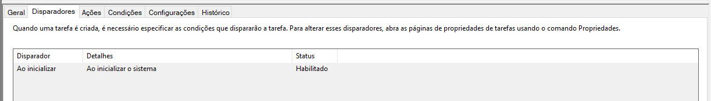

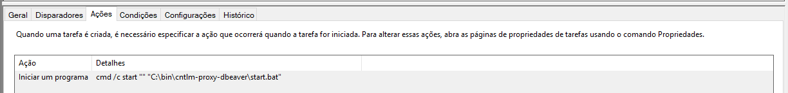

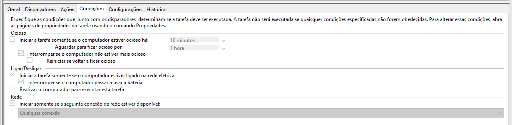

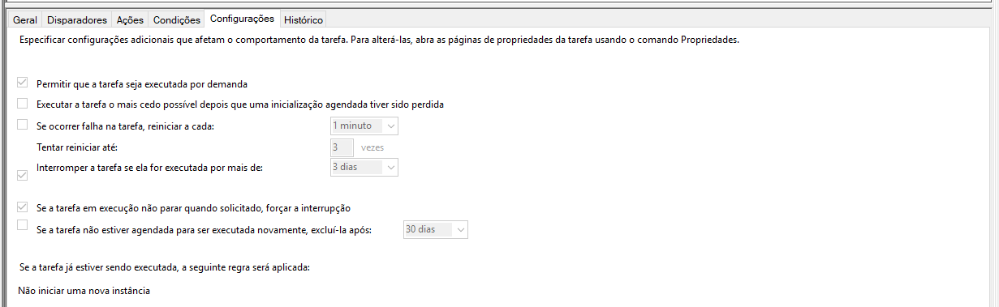

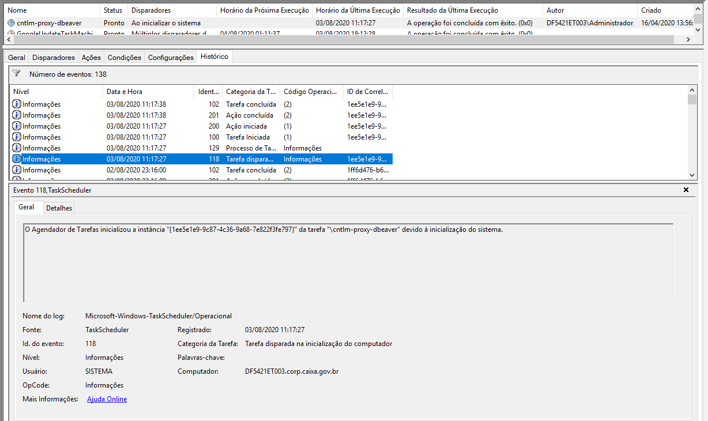

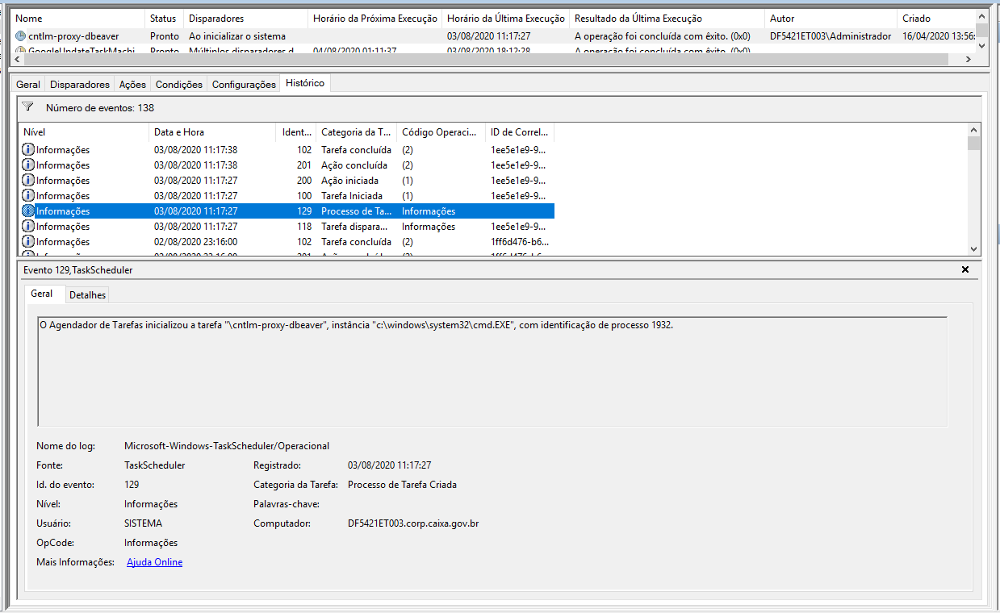

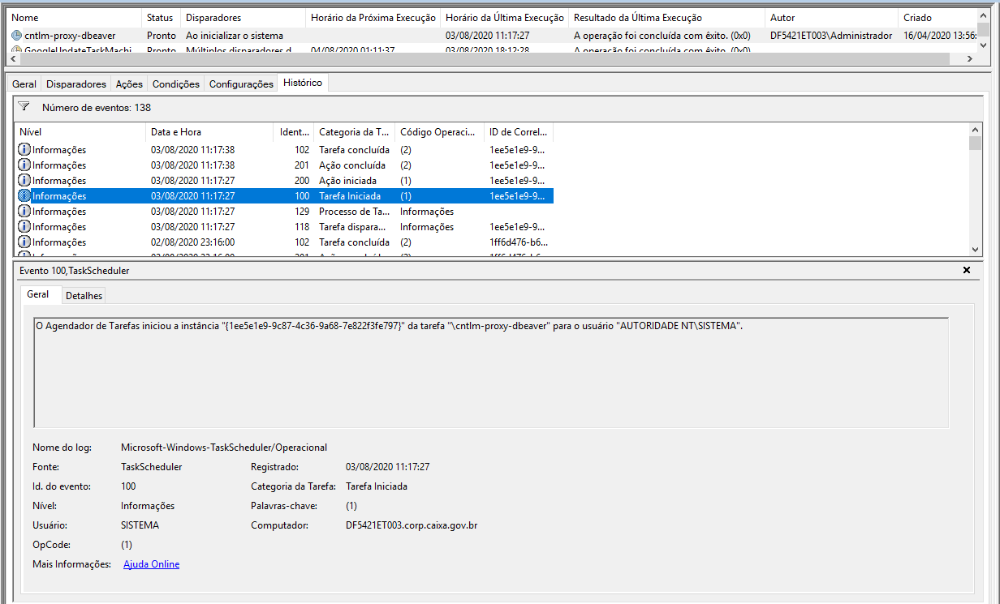

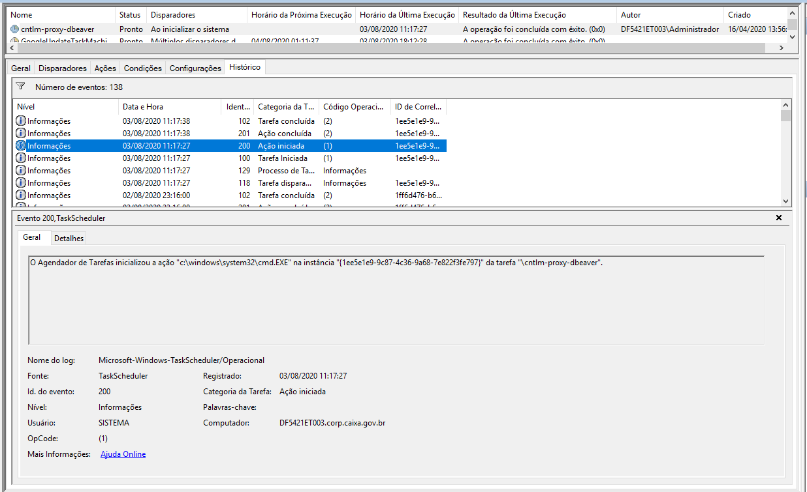

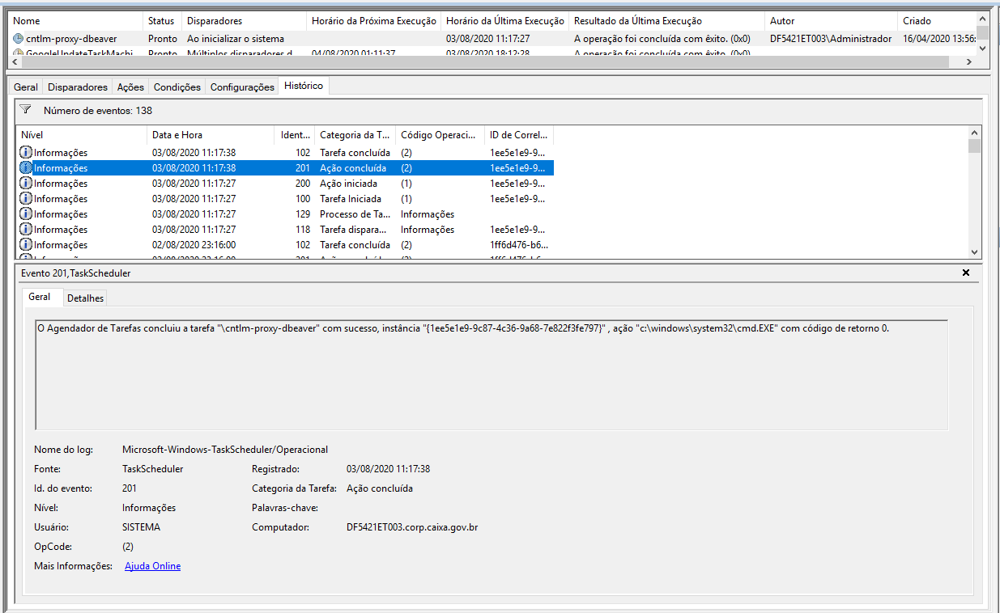

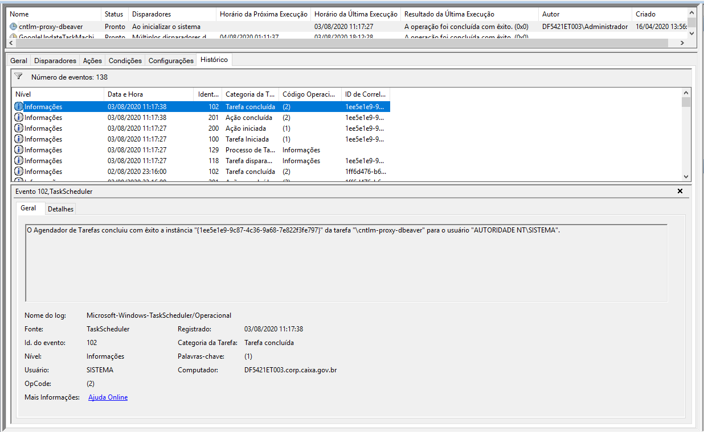

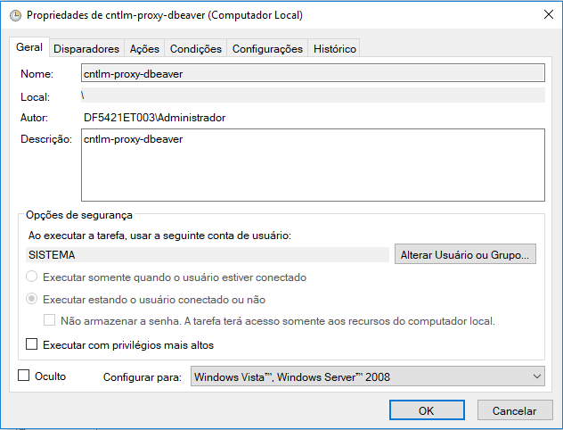

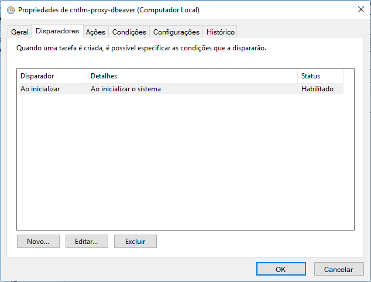

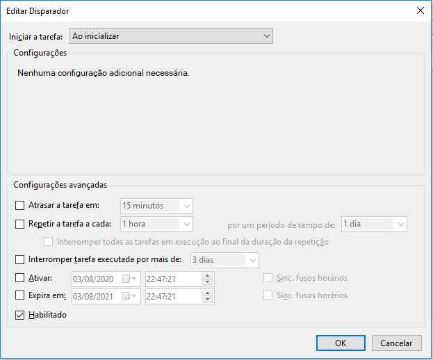

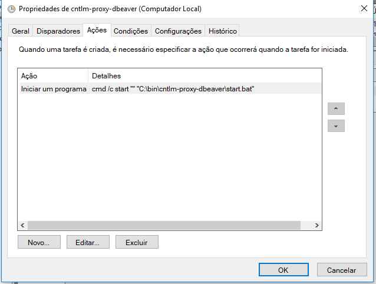

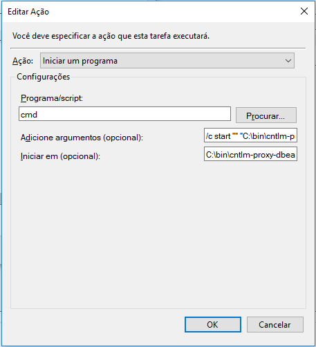

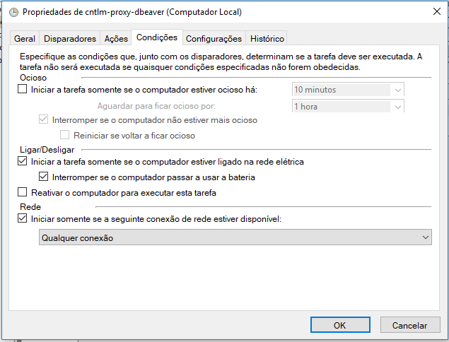

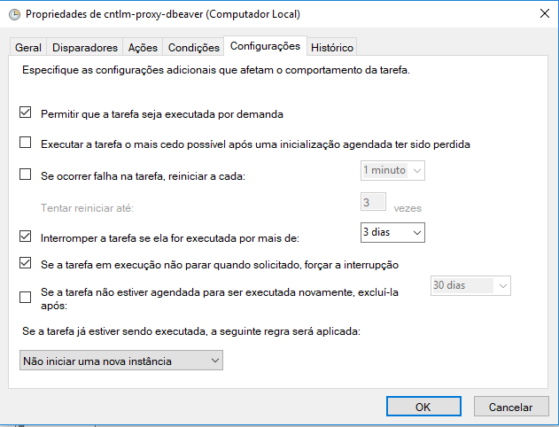

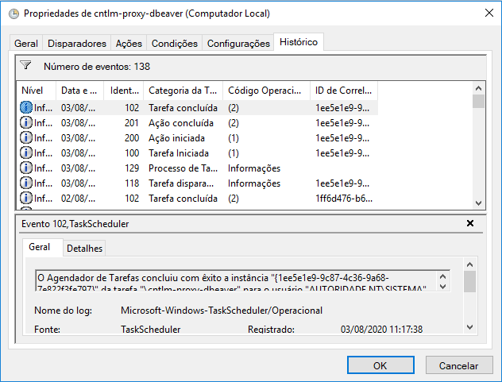

- Para ver um exemplo da task em formato `.xml`, verificar: `task-xml/cntlm-proxy-dbeaver.xml`
